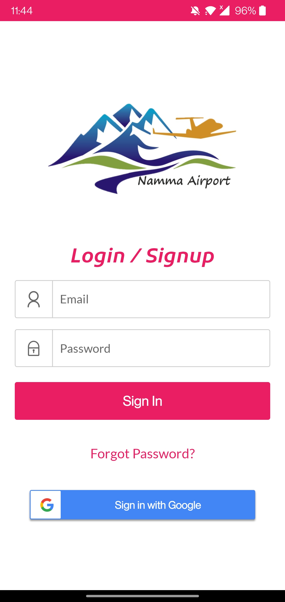
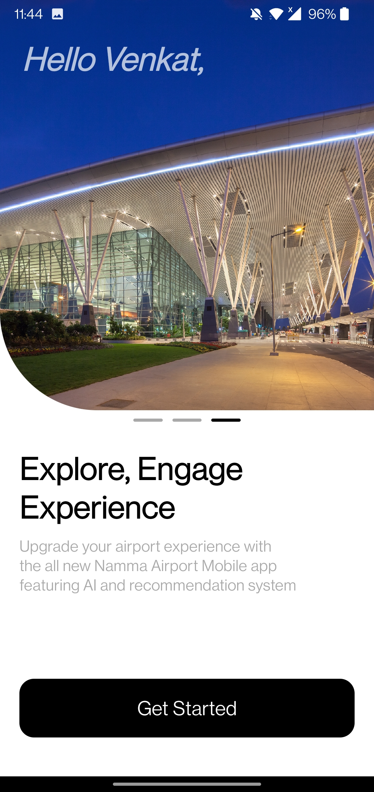
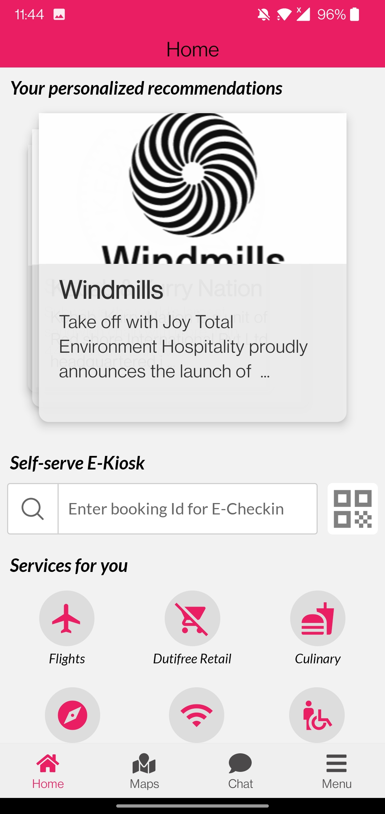
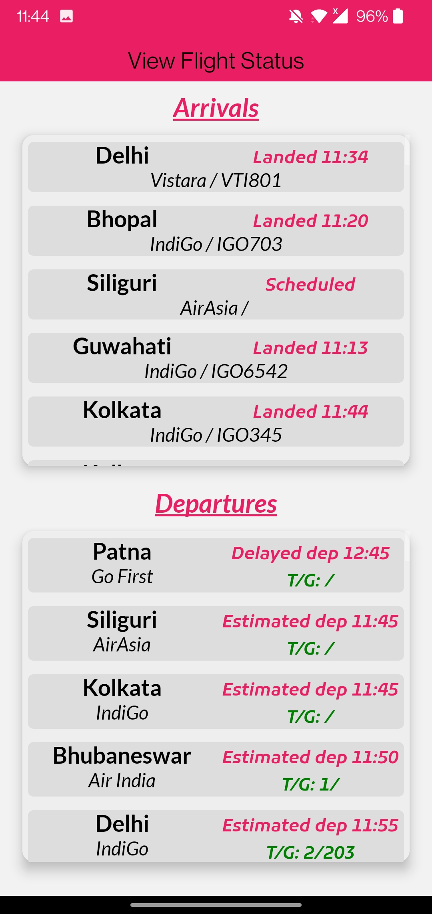
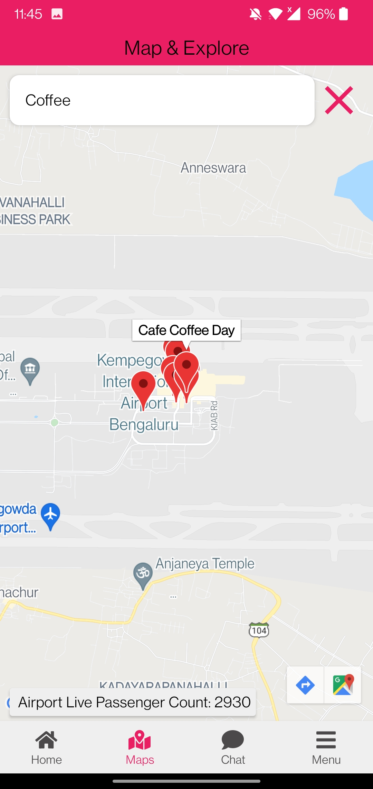
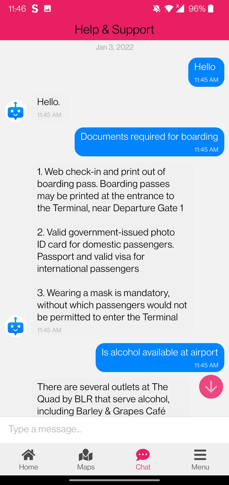
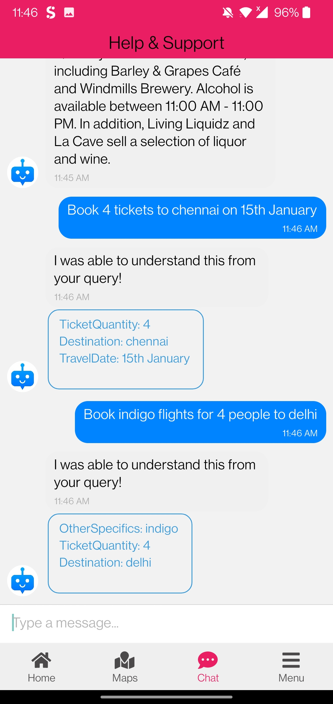
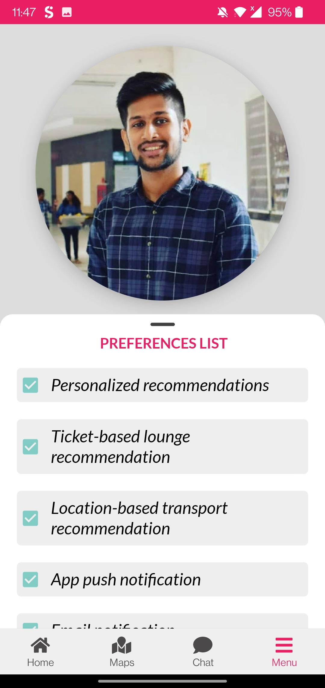

<div id="top"></div>

[![Contributors][contributors-shield]][contributors-url]
[![Forks][forks-shield]][forks-url]
[![Stargazers][stars-shield]][stars-url]
[![Issues][issues-shield]][issues-url]
[![MIT License][license-shield]][license-url]
[![LinkedIn][linkedin-shield]][linkedin-url]

<br />
<div align="center">
  <a href="https://github.com/venkatr21/namma-airport/">
    
  </a>

  <h3 align="center">Namma Airport</h3>

  <p align="center">
    Equipping the Bangalore International Airport application with AI enabled features and enhancing the user experience.
    <br />
    <br />
    <a href="https://github.com/venkatr21/namma-airport">View Demo</a>
    ·
    <a href="https://github.com/venkatr21/namma-airport/issues">Report Bug</a>
    ·
    <a href="https://github.com/venkatr21/namma-airport/issues">Request Feature</a>
  </p>
</div>

<!-- TABLE OF CONTENTS -->
<details>
  <summary>Table of Contents</summary>
  <ol>
    <li>
      <a href="#about-the-project">About The Project</a>
      <ul>
        <li><a href="#built-with">Built With</a></li>
      </ul>
    </li>
    <li>
      <a href="#getting-started">Getting Started</a>
      <ul>
        <li><a href="#prerequisites">Prerequisites</a></li>
        <li><a href="#installation">Installation</a></li>
      </ul>
    </li>
    <li><a href="#azure-services">Azure Services Used</a></li>
    <li><a href="#application-screenshots">Application Screenshots</a></li>
    <li><a href="#roadmap">Roadmap</a></li>
    <li><a href="#contributing">Contributing</a></li>
    <li><a href="#license">License</a></li>
    <li><a href="#contact">Contact</a></li>
    <li><a href="#acknowledgments">Acknowledgments</a></li>
  </ol>
</details>

<!-- ABOUT THE PROJECT -->

## About The Project

Namma Airport is an initiative to enhance and equip the bangalore international airport mobile application with AI enabled features and improve the user experience. Feel free to clone, run and develop further.

<p align="right">(<a href="#top">back to top</a>)</p>

<!-- BUILT WITH -->

### Built With

The list of all tech stacks and Services used to develop Namma Airport's initial prototype

- [Express.js](http://expressjs.com/)
- [React Native](https://reactnative.dev/)
- [Microsoft Azure](https://azure.microsoft.com/en-in/)
- [Flask](https://flask.palletsprojects.com/en/2.0.x/)
- [Docker](https://www.docker.com/)
- [Kubernetes](https://kubernetes.io/)

<p align="right">(<a href="#top">back to top</a>)</p>

<!-- GETTING STARTED -->

## Getting Started

To get a local copy up and running follow these simple steps.

### Prerequisites

- npm

  ```sh
  npm install npm@latest -g
  ```

### Installation

_Setting up the environment and installing the application._

1. Get an Azure Subscription at [Azure Portal](https://azure.microsoft.com/en-in/free/)
2. Clone the repo

   ```sh
   git clone https://github.com/venkatr21/namma-airport.git
   ```

3. Install NPM packages

   ```sh
   cd frontend
   npm install

   cd backend
   npm install
   ```

4. Enter your API Keys in `backend/config/default.json` and `frontend/.env` in the following format

   ```js
    //.env file
    API_KEY = "ENTER YOUR API"
    // default.json
    {
        "KEY_NAME": "KEY_VALUE",
    }
   ```

5. Host the backend and run the frontend developement server with the following command

   ```js
    // run the Metro server
    npx react-native start
    // bundle the application and run it on android
    npx react-native run-android
   ```

<p align="right">(<a href="#top">back to top</a>)</p>

<!-- Azure Services Used -->

## Azure Services

Namma Airport uses a variety of azure services for Personalized recommendation, Chatbot service, geo-spatial services, application hosting and scalability.

1. Azure App service
2. Azure Container registry
3. Azure Kubernetes service
4. Azure QnA maker
5. Azure LUIS
6. Azure Maps
7. Azure Cosmos DB
8. Azure Storage containers
9. Azure App insights
10. Azure Translator and Speech SDK

_For tech implementation, please refer to the [Azure Docs](https://docs.microsoft.com/en-us/azure/?product=popular)_

<p align="right">(<a href="#top">back to top</a>)</p>

<!-- Application Screenshots -->

## Application Screenshots

<br />





<br/>





<p align="right">(<a href="#top">back to top</a>)</p>

<!-- ROADMAP -->

## Roadmap

- [x] Planning and HL Arichitecture
- [x] Backend API development
- [x] Backend deployment to app service
- [x] Frontend development
- [x] Azure QnA and LUIS data
- [x] Chatbot development
- [x] LUIS and Azure QnA Orchestration
- [x] Dockerizing the backend
- [x] Hosting backend on Azure kubernetes
- [ ] Multi-lingual support
- [ ] Enhance Accessibility with text to speech
- [ ] Realtime flight data support

<p align="right">(<a href="#top">back to top</a>)</p>

<!-- CONTRIBUTING -->

## Contributing

Contributions are what make the open source community such an amazing place to learn, inspire, and create. Any contributions you make are **greatly appreciated**.

If you have a suggestion that would make this better, please fork the repo and create a pull request. You can also simply open an issue with the tag "enhancement".
Don't forget to give the project a star! Thanks again!

1. Fork the Project
2. Create your Feature Branch (`git checkout -b feature/AmazingFeature`)
3. Commit your Changes (`git commit -m 'Add some AmazingFeature'`)
4. Push to the Branch (`git push origin feature/AmazingFeature`)
5. Open a Pull Request

<p align="right">(<a href="#top">back to top</a>)</p>

<!-- LICENSE -->

## License

Distributed under the MIT License. See `LICENSE.txt` for more information.

<p align="right">(<a href="#top">back to top</a>)</p>

<!-- CONTACT -->

## Contact

Venkat Ragavan S - [LinkedIn @ Venkat Ragavan S](https://www.linkedin.com/in/venkat-ragavan-29952118b/) - mail2venkat21@gmail.com

[https://github.com/venkatr21/namma-airport](https://github.com/venkatr21/namma-airport)

<p align="right">(<a href="#top">back to top</a>)</p>

<!-- ACKNOWLEDGMENTS -->

## Acknowledgments

Some of the opensourced softwares and packages really gave me a headstart to kick things off!

- [React native gifted chat](https://github.com/FaridSafi/react-native-gifted-chat)
- [React native material bottom tabs](https://reactnavigation.org/docs/material-bottom-tab-navigator/)

<p align="right">(<a href="#top">back to top</a>)</p>

<!-- MARKDOWN LINKS & IMAGES -->

[contributors-shield]: https://img.shields.io/github/contributors/venkatr21/namma-airport.svg?style=for-the-badge
[contributors-url]: https://github.com/venkatr21/namma-airport/graphs/contributors
[forks-shield]: https://img.shields.io/github/forks/venkatr21/namma-airport.svg?style=for-the-badge
[forks-url]: https://github.com/venkatr21/namma-airport/network/members
[stars-shield]: https://img.shields.io/github/stars/venkatr21/namma-airport.svg?style=for-the-badge
[stars-url]: https://github.com/venkatr21/namma-airport/stargazers
[issues-shield]: https://img.shields.io/github/issues/venkatr21/namma-airport.svg?style=for-the-badge
[issues-url]: https://github.com/venkatr21/namma-airport/issues
[license-shield]: https://img.shields.io/github/license/venkatr21/namma-airport.svg?style=for-the-badge
[license-url]: https://github.com/venkatr21/namma-airport/blob/master/LICENSE.txt
[linkedin-shield]: https://img.shields.io/badge/-LinkedIn-black.svg?style=for-the-badge&logo=linkedin&colorB=555
[linkedin-url]: https://www.linkedin.com/in/venkat-ragavan-29952118b/
[product-screenshot]: namma-airport/blob/master/frontend/assets/logo.png
